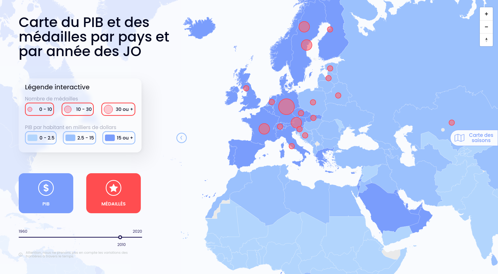

# KTK Data visualization Frontend

Link online site : [KTK - Jeux Olympique](http://vps-080d9e1e.vps.ovh.net:3100/)

Frontend of the data visualization project : [Backend](https://github.com/Coyls/datavise)

If you want use the site in local you will need the same map on [Mapbox](https://www.mapbox.com/) and generate the token.

---

## Environment

To duplicate the project locally you will need [Node/NPM](https://nodejs.dev/), [Docker/Docker-compose](https://www.docker.com/)

Replace the file `.env.example` by `.env`

```s
TOKEN = your_token
MAP = your_map
VPS = http://localhost:3000
```

---

## Docker

Now build the image and run docker

```s
docker-compose build
docker-compose up -d
```

Go on [http://localhost:3100](http://localhost:3100)


